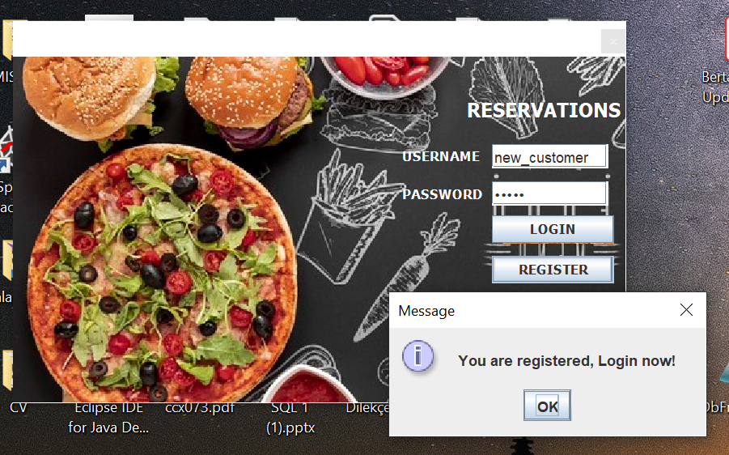
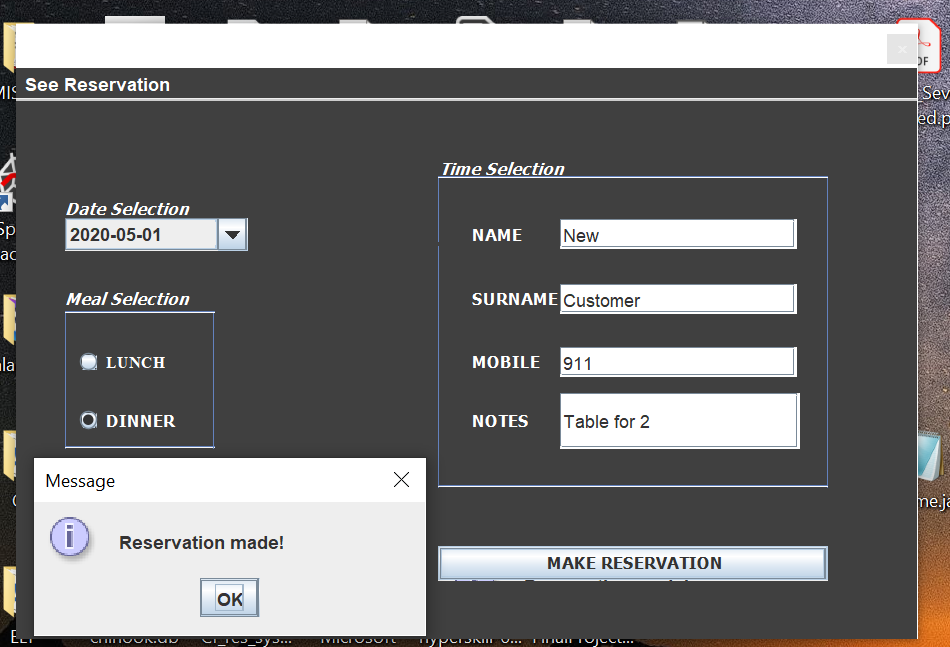
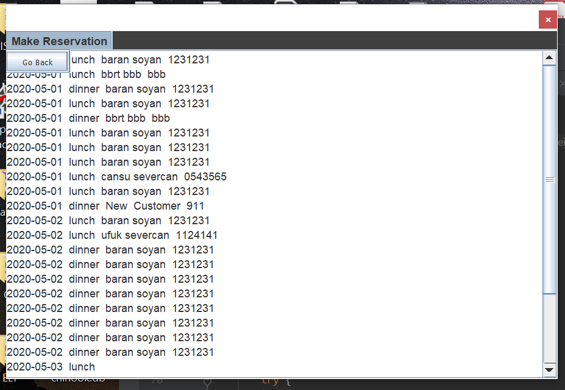

# Full-Stack Restaurant-Res-App
This is a school project that I' ve worked on. It is a simple reservation app. It has a simple GUI and is connected to a database that I created.

- Technologies used: Java, JDBC, MySQL, SQL, Java Swing UI

